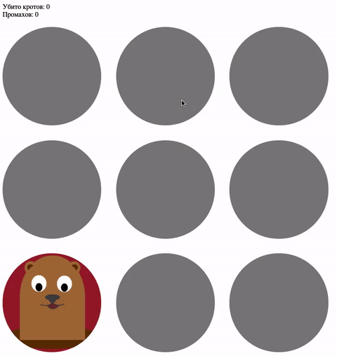

## Игра «Поймай крота»

Дописал игру, ловящую кротов при клике на них. 
В случайной лунке появляется крот. При нажатии на него, 
игроку засчитывается +1 за нажатие. 
Игрок побеждает, если своевременно убивает 10 кротов. 
При 5 поражениях игра заканчивается.

### Процесс реализации

1. Используя цикл зарегистрировал для каждой лунки обработчик событий
2. Проверил наличие нужного класса и увеличил значение нужного счетчика
3. По выигрышу или проигрышу обнулил статистику
