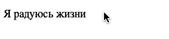

## Ротатор рекламы
Реализовал механизм смены текстовых объявлений. Каждое объявление меняется через 1 секунду.

### Процесс реализации

1. Каждую секунду менял класс с одного элемента на другой
2. Сделал акцент на том, чтобы на странице можно было использовать несколько
ротаторов одновременно
3. Смену текстовых блоков сделал бесконечной.
