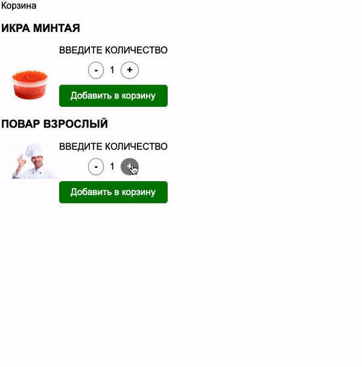

## Корзина товаров

Написал механизм добавления товаров в корзину.

### Процесс реализации

1. При нажатии на кнопки увеличения/уменьшения количества товаров, число
меняется. Минимальное число товаров - 1 (отрицательные значения не допускаются)
2. Реализовал добавление товара в корзину с заданным количеством.
3. Если товар уже имеется в корзине, количество увеличил, не добавляя в корзину новый элемент.
